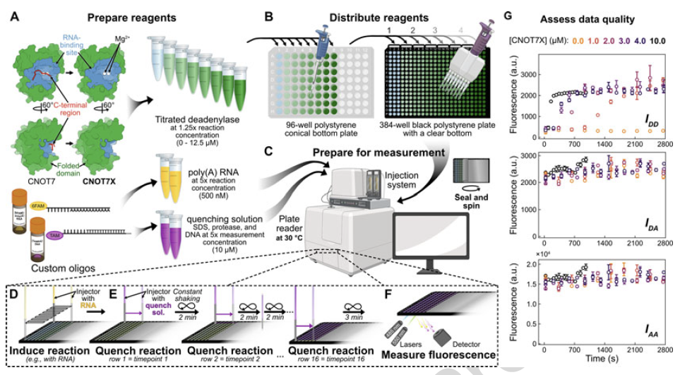
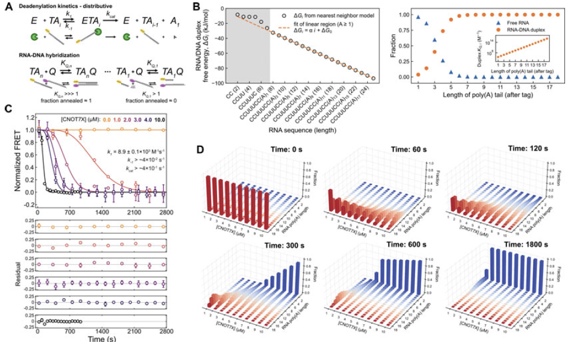

# deadenylationkinetics

## A brief introduction to RNA biochemistry

The production of proteins from mRNA is necessary for living organisms to carry out the molecular transactions that sustain their function. This process needs to be tightly regulated, as over or underproduction of proteins from mRNA can lead to serious diseases. Further, strict control over mRNA levels is paramount to proper embryonic development. The levels of mRNAs are dictated by (i) the addition of a poly(A) tail, which promotes stability, and (ii) through the action of RNA deadenylases, which remove the tail and thus act to destabilize mRNAs by promoting their digestion by nucleases. Given the importance of the RNA deadenylase enzymes involved in regulating mRNA stability and overall levels of mRNA in the cell, it is critical to understand their enzymatic mechanisms in detail.

## An introduction to the deadenylationkinetics package

This package has been developed to work with fluorescence resonance energy transfer (FRET) assay 
data, where the consumption of a poly(A) RNA is monitored as a function of time (Figure 1) [1]. The 
assay uses a labeled RNA that is acted upon by the deadenylase. Time points are taken over the 
course of the reaction, where the reaction is quenched and a complementary labeled DNA strand is added. The initially formed RNA 
species are longer and form a stable, hybrid duplex with the DNA, leading to FRET between the RNA and DNA 
labels. As the RNA distribution tends toward smaller species at longer times, the RNA:DNA duplexes become 
less stable, leading to less of the FRET pair formed and consequently a decay in the signal. The shape of 
this decay profile provides insight into the deadenylation mechanism.

*Figure 1. Schematic of the FRET assay and resultant data reflecting the removal of the poly(A) tail of an RNA strand.*

This package enables the user to simulate and/or fit RNA deadenylation mechanisms to the aforementioned 
FRET assay data in order to determine the most likely case and simultaneously quantify RNA poly(A) tail 
lengths as a function of time (Figure 2) [1]. The current implementation uses a non-processive model, as this 
has been shown to be the case for a model deadenylase, CNOT7, though a processive model and a mixed model 
are in development. The modeling procedure consists of two main parts. First, the reaction kinetics are 
simulated using a system of rate equations and the experimental RNA and enzyme concentrations. Second, the 
concentrations of the RNA species obtained from the kinetics simulations, along with the known DNA strand 
concentration, are implemented in a system of binding equations to determine the amounts of each length 
RNA-DNA hybrid duplex are formed. The sum of these duplex populations is then converted into FRET data for 
visualization by the user or for fitting against the experimental data in the minimization routine.

*Figure 2. Modeling of the kinetics of RNA deadenylation and the thermodynamics of RNA-DNA duplex hybridization.*

## Requirements

* python 3.7  
* pandas  
* numpy  
* scipy  
* matplotlib  
* multiprocessing  
* lmfit
* pyyaml

## Usage

Currently, the package needs to be locally installed by downloading the .zip of the directory, unzipping, and using 

pip install -e . 

in a directory of your choosing. The procedure for simulating or fitting RNA deadenylation data is initiated from the command line using a .yaml configuration file, which contains a number of experimental, data fitting, and data plotting fields to be updated by the user prior to running deadenylationkinetics. The data .csv file must be formatted according to the layout defined in the example dataset for the model deadenylase CNOT7. This .csv file must be in the /data directory with the .yaml file. From terminal, within the data directory, enter

../analysis/main.py [configuration_file.yaml].

to run deadenylationkinetics according to the configuration parameters. Note that the relative path to the main.py file will depend on the directory that the data .csv and .yaml configuration file are placed in.

## References

1. [Irwin, R., Harkness, R.W., Forman-Kay, J.D. (2024). A FRET-Based Assay and Computational Tools to Quantify Enzymatic Rates and Explore the Mechanisms of RNA Deadenylases in Heterogeneous Environments. In: Valkov, E., Goldstrohm, A.C. (eds) Deadenylation. Methods in Molecular Biology, vol 2723. Humana, New York, NY.](https://doi.org/10.1007/978-1-0716-3481-3_5)
